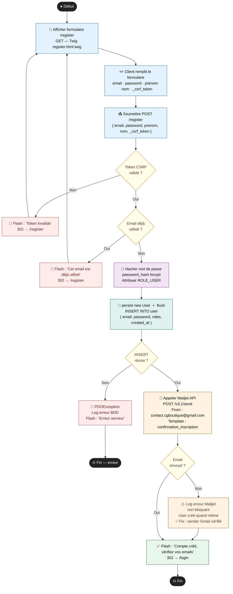
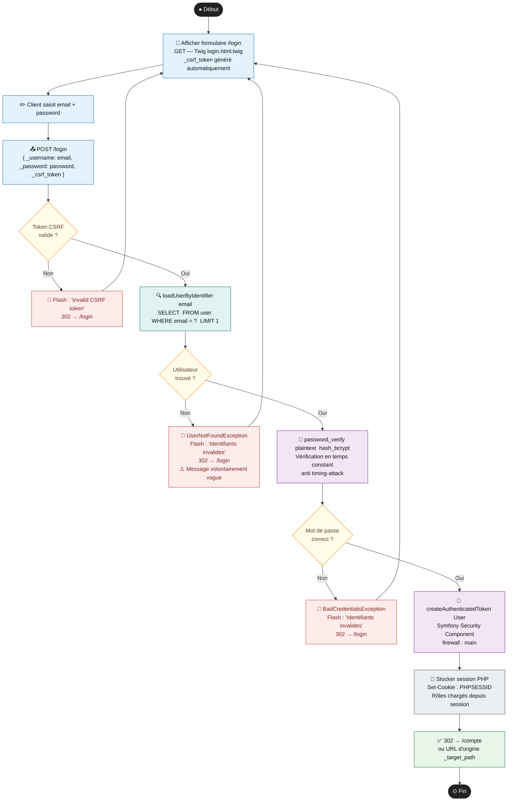
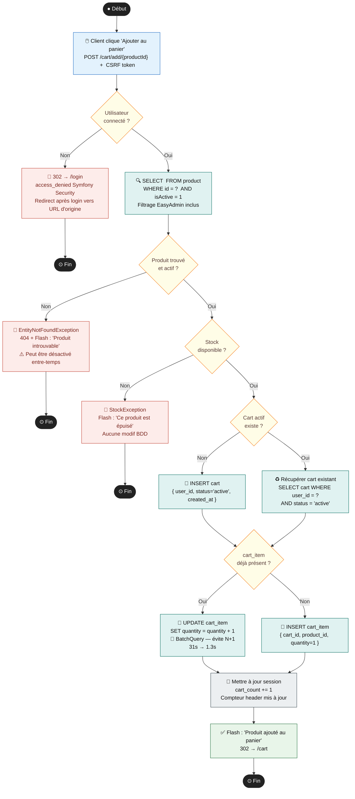
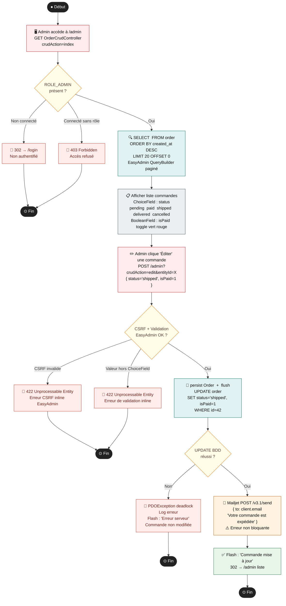
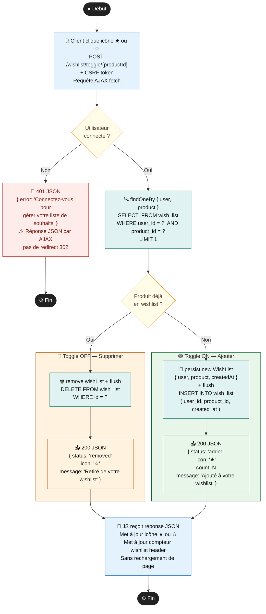

# C.G Boutique — Diagrammes d'Activité en Mermaid

**Projet :** C.G Boutique — E-commerce mode (solo)  
**Stack :** Symfony 7.4 · PHP 8.2 · MySQL/MariaDB · EasyAdmin 5 · Stripe · PayPal · Mailjet · DomPDF · Docker  
**Certification :** CDA — RNCP37873 Niveau 6  
**Auteure :** Gheorghina COSTINCIANU — ADRAR Formation

---

## DA-01 · Inscription Utilisateur

> **Route :** `POST /register` → SecurityController → Doctrine → user (BDD) → Mailjet

**Tables impactées :** `user` (email, password, roles, created_at)  
**Sécurité :** CSRF token Symfony · bcrypt · sender Mailjet vérifié Gmail

---

## DA-02 · Connexion Utilisateur (Login)

> **Route :** `POST /login` → Symfony Security → UserProvider → Session

**Table :** `user` · **Firewall :** main · **CSRF :** form_login activé

---

## DA-03 · Ajout Produit au Panier

> **Route :** `POST /cart/add/{id}` → CartController → CartService → cart / cart_item

**Tables :** `cart`, `cart_item`, `product` · **Optimisation :** BatchQuery (31s → 1.3s)

---

## DA-04 · Paiement Stripe Checkout + Webhook

> **Route :** `POST /order/checkout` → StripeService → Stripe API → Webhook → order

```mermaid
flowchart TD
    START([●  Début]) --> CHECKOUT

    CHECKOUT["🛒 Client valide le panier\nPOST /order/checkout\n{ cart_id, adresse_livraison }"]
    CHECKOUT --> D_CART

    D_CART{Panier\nnon vide ?}
    D_CART -- Non --> ERR_CART["🔴 Flash : 'Votre panier est vide'\n302 → /cart"]
    ERR_CART --> END_ERR1([⊙  Fin])

    D_CART -- Oui --> CREATE_ORDER

    CREATE_ORDER["💾 INSERT order\n{ user_id, total, status='pending'\nisPaid=0, created_at }"]
    CREATE_ORDER --> STRIPE_SESSION

    STRIPE_SESSION["🔌 StripeService.createCheckoutSession\nPOST /v1/checkout/sessions\n{ line_items, success_url, cancel_url\nmetadata: { order_id } }"]
    STRIPE_SESSION --> D_STRIPE

    D_STRIPE{Session Stripe\ncréée ?}
    D_STRIPE -- Non --> ERR_STRIPE["🔴 StripeException / ConnectionException\nUPDATE order SET status='failed'\n500 + Flash : 'Erreur paiement, réessayez'\n⚠️ Vérifier STRIPE_SECRET_KEY .env"]
    ERR_STRIPE --> END_ERR2([⊙  Fin])

    D_STRIPE -- Oui --> REDIRECT_STRIPE

    REDIRECT_STRIPE["↗️ 302 → session.url\nPage CB hébergée Stripe\nPCI-DSS — Stripe gère 3DS"]
    REDIRECT_STRIPE --> CLIENT_CB

    CLIENT_CB["💳 Client saisit coordonnées CB\nsur page Stripe sécurisée\nC.G Boutique ne voit jamais les données CB"]
    CLIENT_CB --> D_CB

    D_CB{Paiement CB\nvalidé par Stripe ?}
    D_CB -- Non --> ERR_CB["🔴 Stripe affiche l'erreur\nCarte refusée / fonds insuffisants\n3DS échoué\nAucun webhook envoyé"]
    ERR_CB --> END_ERR3([⊙  Fin])

    D_CB -- Oui --> WEBHOOK

    subgraph PHASE2 ["⚡ Phase 2 — Webhook asynchrone Stripe"]
        WEBHOOK["📨 Stripe POST /stripe/webhook\n{ event: checkout.session.completed\nStripe-Signature: … }"]
        WEBHOOK --> D_SIG

        D_SIG{Signature\nwebhook valide ?}
        D_SIG -- Non --> ERR_SIG["🔴 400 Bad Request\n'Invalid signature'\nStripe relancera le webhook\n⚠️ Vérifier STRIPE_WEBHOOK_SECRET"]
        ERR_SIG --> END_ERR4([⊙  Fin])

        D_SIG -- Oui --> UPDATE_ORDER

        UPDATE_ORDER["💾 UPDATE order\nSET isPaid=1, status='paid'\nstripe_session_id=?\nWHERE id=order_id"]
        UPDATE_ORDER --> D_DB

        D_DB{UPDATE BDD\nréussi ?}
        D_DB -- Non --> ERR_DB["🔴 PDOException\nLog erreur\nStripe relancera webhook\n💡 Prévoir idempotence\nvia stripe_session_id"]
        ERR_DB --> END_ERR5([⊙  Fin])

        D_DB -- Oui --> SEND_EMAIL

        SEND_EMAIL["📧 Mailjet POST /v3.1/send\n{ confirmation commande\n+ PDF facture DomPDF }"]
        SEND_EMAIL --> ACK

        ACK["✅ 200 OK → Stripe\nAcquittement webhook\nobligatoire  30s"]
    end

    ACK --> PAGE_SUCCESS

    PAGE_SUCCESS["🎉 Client — GET /order/success\nPage 'Commande confirmée'\n+ numéro de commande"]
    PAGE_SUCCESS --> END([⊙  Fin])

    style START fill:#222,color:#fff,stroke:#222
    style END fill:#222,color:#fff,stroke:#222
    style END_ERR1 fill:#222,color:#fff,stroke:#222
    style END_ERR2 fill:#222,color:#fff,stroke:#222
    style END_ERR3 fill:#222,color:#fff,stroke:#222
    style END_ERR4 fill:#222,color:#fff,stroke:#222
    style END_ERR5 fill:#222,color:#fff,stroke:#222
    style PHASE2 fill:#FFF8E1,stroke:#F9A825
    style D_CART fill:#FFFDE7,stroke:#F57F17,color:#5D4037
    style D_STRIPE fill:#FFFDE7,stroke:#F57F17,color:#5D4037
    style D_CB fill:#FFFDE7,stroke:#F57F17,color:#5D4037
    style D_SIG fill:#FFFDE7,stroke:#F57F17,color:#5D4037
    style D_DB fill:#FFFDE7,stroke:#F57F17,color:#5D4037
    style ERR_CART fill:#FDECEA,stroke:#C0392B,color:#7B241C
    style ERR_STRIPE fill:#FDECEA,stroke:#C0392B,color:#7B241C
    style ERR_CB fill:#FDECEA,stroke:#C0392B,color:#7B241C
    style ERR_SIG fill:#FDECEA,stroke:#C0392B,color:#7B241C
    style ERR_DB fill:#FDECEA,stroke:#C0392B,color:#7B241C
    style CHECKOUT fill:#E3F2FD,stroke:#1565C0,color:#111
    style CLIENT_CB fill:#E3F2FD,stroke:#1565C0,color:#111
    style CREATE_ORDER fill:#E0F2F1,stroke:#00695C,color:#111
    style UPDATE_ORDER fill:#E0F2F1,stroke:#00695C,color:#111
    style STRIPE_SESSION fill:#F3E5F5,stroke:#6A1B9A,color:#111
    style REDIRECT_STRIPE fill:#E3F2FD,stroke:#1565C0,color:#111
    style WEBHOOK fill:#FFF3E0,stroke:#B7570B,color:#111
    style SEND_EMAIL fill:#FFF3E0,stroke:#B7570B,color:#111
    style ACK fill:#E8F5E9,stroke:#1A6B35,color:#111
    style PAGE_SUCCESS fill:#E8F5E9,stroke:#1A6B35,color:#111
```

**Tables :** `order` (isPaid BOOLEAN, status VARCHAR) · **Env :** STRIPE_SECRET_KEY, STRIPE_WEBHOOK_SECRET

---

## DA-05 · Paiement PayPal (JS SDK)

> **Route :** `GET /order/paypal` → PayPal JS SDK → PayPal API → PayPalController → order

```mermaid
flowchart TD
    START([●  Début]) --> PAGE

    PAGE["📄 GET /order/paypal\nAfficher page avec bouton PayPal\n{ PAYPAL_CLIENT_ID injecté }"]
    PAGE --> JS_LOAD

    JS_LOAD["⚙️ PayPal JS SDK chargé\nDOMContentLoaded guard appliqué\n💡 Fix : TypeError dataset corrigé\nBouton PayPal rendu dans le DOM"]
    JS_LOAD --> CLICK

    CLICK["🖱️ Client clique 'Payer avec PayPal'\ncreateOrder() déclenché par JS SDK"]
    CLICK --> CREATE_ORDER

    CREATE_ORDER["🔌 JS SDK → PayPal API\nPOST /v2/checkout/orders\n{ intent: CAPTURE\namount: { value, currency: EUR } }"]
    CREATE_ORDER --> D_CREATE

    D_CREATE{Order PayPal\ncréé ?}
    D_CREATE -- Non --> ERR_CREATE["🔴 API PayPal erreur\nErreur inline JS affichée\nPOST /paypal/cancel\norder status='cancelled'"]
    ERR_CREATE --> END_ERR1([⊙  Fin])

    D_CREATE -- Oui --> POPUP

    POPUP["🪟 201 { id: ORDER_ID, status: CREATED }\nPopup PayPal ouverte\nClient se connecte à son compte PayPal"]
    POPUP --> D_APPROVE

    D_APPROVE{Client\napprouve ?}
    D_APPROVE -- Non --> ERR_CANCEL["🔴 onCancel() déclenché\n'Paiement annulé'\nPopup fermée sans paiement"]
    ERR_CANCEL --> END_ERR2([⊙  Fin])

    D_APPROVE -- Oui --> CAPTURE

    CAPTURE["🔌 onApprove data\nJS SDK → PayPal API\nPOST /v2/checkout/orders/{ORDER_ID}/capture"]
    CAPTURE --> D_CAPTURE

    D_CAPTURE{Capture\nacceptée ?}
    D_CAPTURE -- Non --> ERR_CAPTURE["🔴 INSTRUMENT_DECLINED  422\n'Paiement refusé PayPal'\nFonds insuffisants\nCompte restreint"]
    ERR_CAPTURE --> END_ERR3([⊙  Fin])

    D_CAPTURE -- Oui --> NOTIFY_BACKEND

    NOTIFY_BACKEND["📤 JS → backend Symfony\nPOST /paypal/capture\n{ orderID, captureID }\n200 { status: COMPLETED, capture_id: CAP_xxx }"]
    NOTIFY_BACKEND --> UPDATE_ORDER

    UPDATE_ORDER["💾 PayPalController\nUPDATE order\nSET isPaid=1, status='paid'\npaypal_order_id=ORDER_ID"]
    UPDATE_ORDER --> MAILJET

    MAILJET["📧 Mailjet POST /v3.1/send\n{ email confirmation commande }"]
    MAILJET --> SUCCESS

    SUCCESS["✅ JSON { status: 'success' }\nJS redirige → /order/success"]
    SUCCESS --> END([⊙  Fin])

    style START fill:#222,color:#fff,stroke:#222
    style END fill:#222,color:#fff,stroke:#222
    style END_ERR1 fill:#222,color:#fff,stroke:#222
    style END_ERR2 fill:#222,color:#fff,stroke:#222
    style END_ERR3 fill:#222,color:#fff,stroke:#222
    style D_CREATE fill:#FFFDE7,stroke:#F57F17,color:#5D4037
    style D_APPROVE fill:#FFFDE7,stroke:#F57F17,color:#5D4037
    style D_CAPTURE fill:#FFFDE7,stroke:#F57F17,color:#5D4037
    style ERR_CREATE fill:#FDECEA,stroke:#C0392B,color:#7B241C
    style ERR_CANCEL fill:#FDECEA,stroke:#C0392B,color:#7B241C
    style ERR_CAPTURE fill:#FDECEA,stroke:#C0392B,color:#7B241C
    style PAGE fill:#E3F2FD,stroke:#1565C0,color:#111
    style CLICK fill:#E3F2FD,stroke:#1565C0,color:#111
    style JS_LOAD fill:#F3E5F5,stroke:#6A1B9A,color:#111
    style CREATE_ORDER fill:#F3E5F5,stroke:#6A1B9A,color:#111
    style POPUP fill:#E3F2FD,stroke:#1565C0,color:#111
    style CAPTURE fill:#F3E5F5,stroke:#6A1B9A,color:#111
    style NOTIFY_BACKEND fill:#E3F2FD,stroke:#1565C0,color:#111
    style UPDATE_ORDER fill:#E0F2F1,stroke:#00695C,color:#111
    style MAILJET fill:#FFF3E0,stroke:#B7570B,color:#111
    style SUCCESS fill:#E8F5E9,stroke:#1A6B35,color:#111
```

**Table :** `order` · **Env :** PAYPAL_CLIENT_ID, PAYPAL_SECRET · **Fix :** DOMContentLoaded guard

---

## DA-06 · Réinitialisation du Mot de Passe

> **Route :** `POST /reset-password` → ResetPasswordController → reset_password_request → Mailjet

```mermaid
flowchart TD
    START([●  Début]) --> FORM

    FORM["📄 Afficher formulaire /reset-password\nGET — saisir email"]
    FORM --> POST

    POST["📤 POST /reset-password\n{ email }"]
    POST --> CHECK_TOKEN

    subgraph PHASE1 ["📨 Phase 1 — Demande de réinitialisation"]
        CHECK_TOKEN["🔍 SELECT reset_password_request\nWHERE user.email = ?\nAND expiresAt  NOW"]
        CHECK_TOKEN --> D_TOKEN_EXISTS

        D_TOKEN_EXISTS{Token valide\nnon expiré ?}
        D_TOKEN_EXISTS -- Oui --> REUSE["♻️ Réutiliser token existant\nthrottling anti-spam\nPas de nouveau INSERT"]
        D_TOKEN_EXISTS -- Non --> NEW_TOKEN

        NEW_TOKEN["💾 Générer token HMAC\nINSERT reset_password_request\n{ token_hash, expiresAt=+1h, user_id }"]

        REUSE --> SEND_EMAIL
        NEW_TOKEN --> SEND_EMAIL

        SEND_EMAIL["📧 Mailjet POST /v3.1/send\nFrom : contact.cgboutique@gmail.com\n{ lien /reset-password/reset/{token} }\n💡 Fix : sender Gmail vérifié"]
        SEND_EMAIL --> D_EMAIL

        D_EMAIL{Email\nenvoyé ?}
        D_EMAIL -- Non --> LOG_MJ["⚠️ Log erreur Mailjet\nnon bloquant\nUser peut redemander"]
        D_EMAIL -- Oui --> CHECK_EMAIL

        LOG_MJ --> CHECK_EMAIL

        CHECK_EMAIL["✉️ 302 → /reset-password/check-email\n📌 Même message si email existe ou non\nanti-énumération"]
    end

    CHECK_EMAIL --> WAIT

    WAIT["⏳ Client reçoit l'email\net clique sur le lien"]
    WAIT --> CLICK_LINK

    subgraph PHASE2 ["🔑 Phase 2 — Réinitialisation via le lien"]
        CLICK_LINK["🔗 GET /reset-password/reset/{token}\nExtraction du token depuis l'URL"]
        CLICK_LINK --> VALIDATE

        VALIDATE["🔐 validateTokenAndFetchUser token\nSELECT + vérification HMAC\nExpiration  1h · Usage unique"]
        VALIDATE --> D_VALID

        D_VALID{Token\nvalide ?}
        D_VALID -- Non --> ERR_TOKEN["🔴 InvalidResetPasswordTokenException\nFlash : 'Lien expiré'\n302 → /reset-password\n⚠️ Valide 1h, usage unique"]
        ERR_TOKEN --> END_ERR([⊙  Fin — erreur])

        D_VALID -- Oui --> NEW_FORM

        NEW_FORM["📄 Afficher formulaire\nnouv eau mot de passe"]
        NEW_FORM --> POST2

        POST2["📤 POST /reset-password/reset/{token}\n{ newPassword, confirmPassword }"]
        POST2 --> UPDATE

        UPDATE["💾 UPDATE user\nSET password = hash newPassword\nDELETE reset_password_request\nWHERE user_id = ?"]
    end

    UPDATE --> SUCCESS

    SUCCESS["✅ Flash : 'Mot de passe modifié avec succès'\n302 → /login"]
    SUCCESS --> END([⊙  Fin])

    style START fill:#222,color:#fff,stroke:#222
    style END fill:#222,color:#fff,stroke:#222
    style END_ERR fill:#222,color:#fff,stroke:#222
    style PHASE1 fill:#FFF8E1,stroke:#F9A825
    style PHASE2 fill:#E8F5FE,stroke:#1565C0
    style D_TOKEN_EXISTS fill:#FFFDE7,stroke:#F57F17,color:#5D4037
    style D_EMAIL fill:#FFFDE7,stroke:#F57F17,color:#5D4037
    style D_VALID fill:#FFFDE7,stroke:#F57F17,color:#5D4037
    style ERR_TOKEN fill:#FDECEA,stroke:#C0392B,color:#7B241C
    style LOG_MJ fill:#FFF3E0,stroke:#B7570B,color:#5D4037
    style REUSE fill:#FFF3E0,stroke:#B7570B,color:#111
    style FORM fill:#E3F2FD,stroke:#1565C0,color:#111
    style POST fill:#E3F2FD,stroke:#1565C0,color:#111
    style NEW_FORM fill:#E3F2FD,stroke:#1565C0,color:#111
    style POST2 fill:#E3F2FD,stroke:#1565C0,color:#111
    style CLICK_LINK fill:#E3F2FD,stroke:#1565C0,color:#111
    style CHECK_TOKEN fill:#E0F2F1,stroke:#00695C,color:#111
    style NEW_TOKEN fill:#E0F2F1,stroke:#00695C,color:#111
    style VALIDATE fill:#E0F2F1,stroke:#00695C,color:#111
    style UPDATE fill:#E0F2F1,stroke:#00695C,color:#111
    style SEND_EMAIL fill:#FFF3E0,stroke:#B7570B,color:#111
    style CHECK_EMAIL fill:#ECEFF1,stroke:#37474F,color:#111
    style WAIT fill:#ECEFF1,stroke:#37474F,color:#111
    style SUCCESS fill:#E8F5E9,stroke:#1A6B35,color:#111
```

**Tables :** `reset_password_request`, `user` · **Bundle :** symfonycasts/reset-password-bundle · **Fix :** sender Gmail

---

## DA-07 · Administration Commandes — EasyAdmin 5

> **Route :** `/admin` → EasyAdmin OrderCrudController → order → Mailjet

**Table :** `order` · **ChoiceField :** pending/paid/shipped/delivered/cancelled · **BooleanField :** isPaid

---

## DA-08 · Gestion Wishlist (Toggle Add/Remove)

> **Route :** `POST /wishlist/toggle/{id}` → WishListController → WishListRepository → wish_list

**Table :** `wish_list` (user_id FK, product_id FK, created_at) · **Réponse :** JSON AJAX · **Icône :** ★/☆ en temps réel

---

## Légende générale

| Symbole | Signification UML |
|---|---|
| ● (cercle noir plein) | Initial Node — début du processus |
| ⊙ (cercle double) | Activity Final Node — fin du processus |
| Rectangle arrondi | Action — activité exécutée |
| Losange | Decision Node — bifurcation conditionnelle |
| Sous-graphe | Partition / Region — regroupement logique |
| 🔴 Rouge | Chemin d'erreur — exception ou validation échouée |
| 🟡 Jaune | Décision — condition à évaluer |
| 🟢 Vert | Chemin nominal — succès |
| 🔵 Bleu | Action côté client / navigateur |
| 🟣 Violet | Service interne Symfony |
| 🩵 Cyan | Interaction base de données |
| 🟠 Orange | API tierce (Mailjet, Stripe, PayPal) |