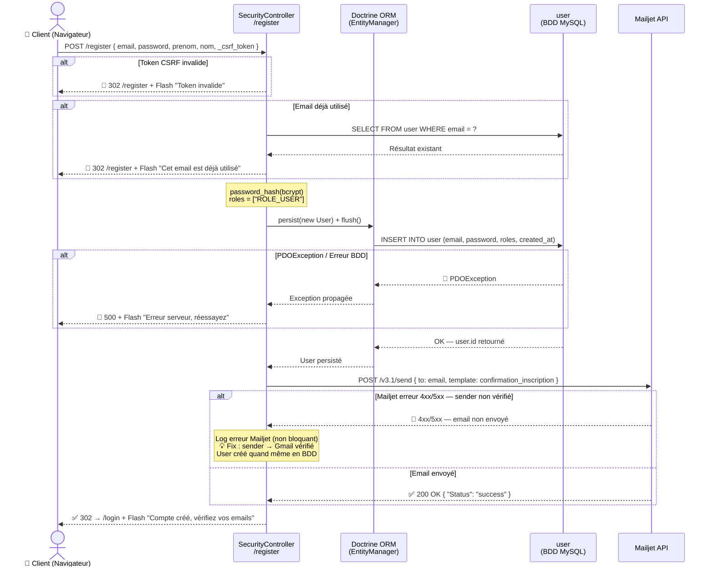
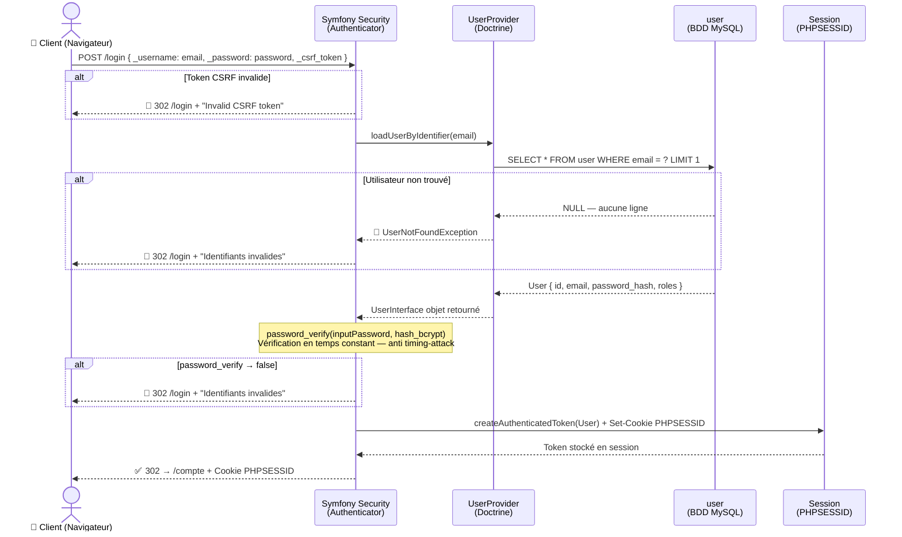
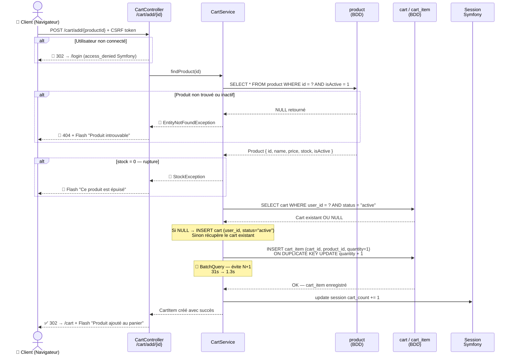
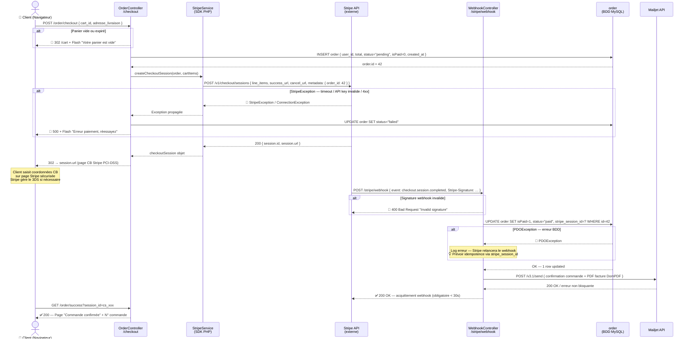
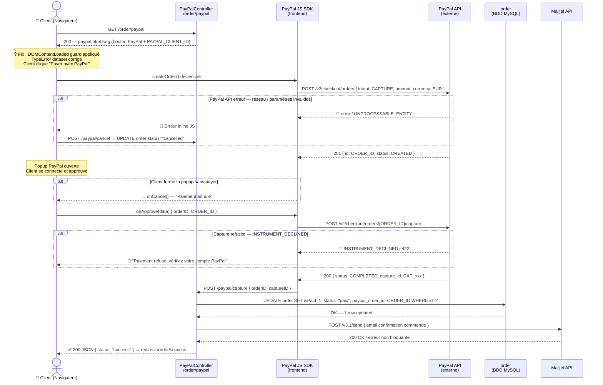
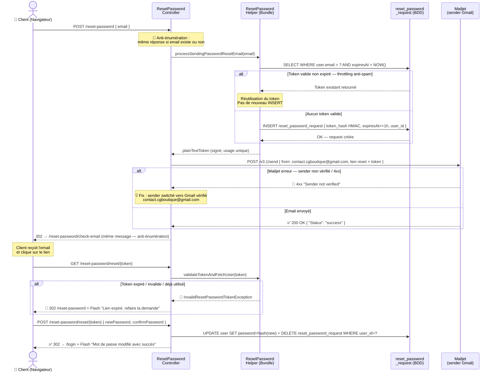
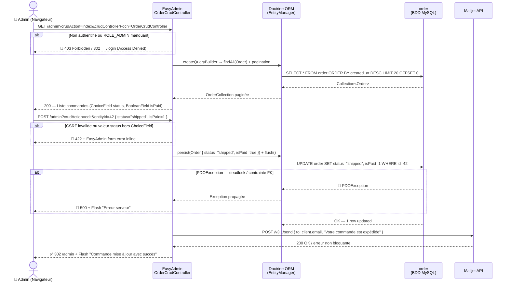
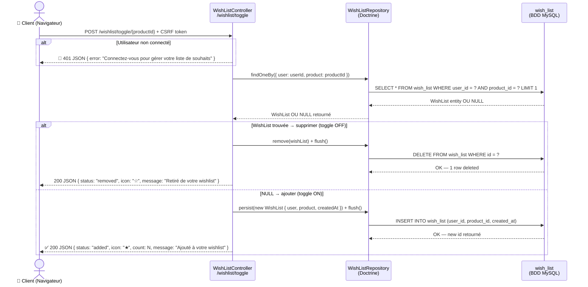

# C.G Boutique — Diagrammes de Séquences en Mermaid

**Projet :** C.G Boutique — E-commerce mode (solo)  
**Stack :** Symfony 7.4 · PHP 8.2 · MySQL/MariaDB · EasyAdmin 5 · Stripe · PayPal · Mailjet · DomPDF  
**Auteure :** Gheorghina COSTINCIANU — ADRAR Formation

---

## DS-01 · Inscription Utilisateur

> **Route :** `POST /register` → SecurityController → Doctrine → user (BDD) → Mailjet

**Tables :** `user` · **Fix :** sender Mailjet → contact.cgboutique@gmail.com · **CSRF :** Symfony Security

---

## DS-02 · Connexion Utilisateur (Login)

> **Route :** `POST /login` → Symfony Security → UserProvider → Session

**Table :** `user` · **Firewall :** main · **CSRF :** form_login activé · **Session :** NativeSessionStorage

---

## DS-03 · Ajout Produit au Panier

> **Route :** `POST /cart/add/{id}` → CartController → CartService → cart / cart_item

**Tables :** `cart`, `cart_item`, `product` · **Optimisation :** BatchQuery (31s → 1.3s)

---

## DS-04 · Paiement Stripe Checkout + Webhook

> **Route :** `POST /order/checkout` → StripeService → Stripe API → Webhook → order (isPaid=1)

**Tables :** `order` (isPaid BOOLEAN, status VARCHAR) · **Env :** STRIPE_SECRET_KEY, STRIPE_WEBHOOK_SECRET

---

## DS-05 · Paiement PayPal (JS SDK)

> **Route :** `GET /order/paypal` → PayPal JS SDK → PayPal API → PayPalController → order (isPaid=1)

**Table :** `order` · **Fix :** DOMContentLoaded guard · **Env :** PAYPAL_CLIENT_ID, PAYPAL_SECRET

---

## DS-06 · Réinitialisation du Mot de Passe

> **Route :** `POST /reset-password` → ResetPasswordController → reset_password_request → Mailjet

**Tables :** `reset_password_request`, `user` · **Bundle :** symfonycasts/reset-password-bundle · **Fix :** sender Gmail

---

## DS-07 · Administration Commandes — EasyAdmin 5

> **Route :** `/admin` → EasyAdmin OrderCrudController → order → Mailjet

**Table :** `order` · **ChoiceField :** pending/paid/shipped/delivered/cancelled · **BooleanField :** isPaid

---

## DS-08 · Gestion Wishlist (Toggle Add/Remove)

> **Route :** `POST /wishlist/toggle/{id}` → WishListController → WishListRepository → wish_list

**Table :** `wish_list` (user_id FK, product_id FK, created_at) · **Réponse :** JSON AJAX · **Icône :** ★/☆ temps réel

---

## Légende

| Symbole Mermaid | Signification UML |
|---|---|
| `Client->>SC:` | Message synchrone (flèche pleine) — appel |
| `SC-->>Client:` | Message de retour (flèche pointillée) — réponse |
| `alt ... else ... end` | Combined Fragment **alt** — cas alternatifs |
| `Note over X:` | Commentaire / annotation sur une lifeline |
| `actor` | Acteur externe (utilisateur humain) |
| `participant` | Système / composant interne |
| 🔴 préfixe | Chemin d'erreur — exception ou validation échouée |
| ✅ préfixe | Chemin nominal — succès |