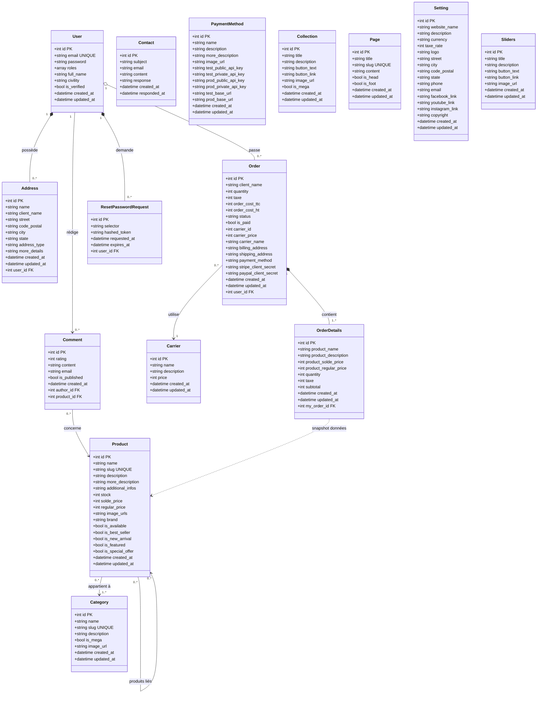

# C.G Boutique — Diagramme de Classes (Mermaid)

**Projet :** C.G Boutique — E-commerce mode (solo)  
**Stack :** Symfony 7.4 · PHP 8.2 · MySQL/MariaDB · Doctrine ORM  
**Source :** Basé sur le schéma SQL réel `ecommerce-cg.sql`  
**Certification :** CDA — RNCP37873 Niveau 6  
**Auteure :** Gheorghina COSTINCIANU — ADRAR Formation

---

## Diagramme de Classes Complet



---

## Légende des relations

| Notation Mermaid | Type UML | Signification dans C.G Boutique |
|---|---|---|
| `A "1" *-- "0..*" B` | **Composition** | B ne peut pas exister sans A. Si A est supprimé, B l'est aussi |
| `A "1" o-- "0..*" B` | **Agrégation** | B peut exister indépendamment de A |
| `A "1" --> "0..*" B` | **Association** | A utilise B, relation directe avec FK |
| `A ..> B` | **Dépendance** | A dépend de B sans FK directe (données copiées) |

---

## Détail des relations identifiées depuis le SQL

### Compositions (cycle de vie lié)

| Classe parent | Classe enfant | Raison |
|---|---|---|
| `User` | `Address` | `ON DELETE CASCADE` implicite — adresses appartiennent à l'user |
| `User` | `ResetPasswordRequest` | Token supprimé après usage ou si user supprimé |
| `Order` | `OrderDetails` | Les lignes de commande n'ont aucun sens sans la commande |

### Agrégations (cycle de vie indépendant)

| Classe parent | Classe enfant | Raison |
|---|---|---|
| `User` | `Order` | Une commande peut être conservée même si l'user est archivé |

### Associations simples (FK directe)

| Classe source | Classe cible | Cardinalité | FK dans SQL |
|---|---|---|---|
| `Order` | `Carrier` | N → 1 | `carrier_id` + snapshot (carrier_name, carrier_price) |
| `Comment` | `User` | N → 1 | `author_id` → `user.id` |
| `Comment` | `Product` | N → 1 | `product_id` → `product.id` |
| `Product` | `Category` | N ↔ N | Table pivot `product_category` |
| `Product` | `Product` | N ↔ N | Table pivot `product_related_products` |

### Classes indépendantes (pas de FK)

| Classe | Rôle dans le projet |
|---|---|
| `Contact` | Formulaire de contact client → réponse admin dans EasyAdmin |
| `Collection` | Bannières promotionnelles gérées via EasyAdmin |
| `Page` | Pages statiques (CGV, Mentions légales) gérées via EasyAdmin |
| `Setting` | Configuration globale du site (nom, logo, réseaux sociaux) |
| `Sliders` | Carrousel hero page d'accueil géré via EasyAdmin |
| `PaymentMethod` | Configuration Stripe/PayPal (clés API) gérée via EasyAdmin |

---

## Tables pivot (relations ManyToMany)

Ces tables n'apparaissent pas comme classes dans le diagramme car elles sont gérées automatiquement par Doctrine ORM :

```
product_category          → Product ↔ Category (ManyToMany)
product_related_products  → Product ↔ Product  (ManyToMany auto-référence)
```

---

## Notes Symfony / Doctrine

- **`Order::status`** → géré par un `ChoiceField` EasyAdmin : `pending | paid | shipped | delivered | cancelled`
- **`Order::is_paid`** → `BooleanField` EasyAdmin (tinyint MySQL → bool PHP)
- **`OrderDetails`** → snapshot du produit au moment de l'achat (product_name, product_solde_price copiés) — pas de FK vers Product intentionnellement pour conserver l'historique si le produit est modifié ou supprimé
- **`User::roles`** → JSON array en BDD (`["ROLE_USER"]`, `["ROLE_USER","ROLE_ADMIN"]`)
- **`ResetPasswordRequest`** → géré par le bundle `symfonycasts/reset-password-bundle`
- **`Product::image_urls`** → JSON stringifié contenant les URLs des images